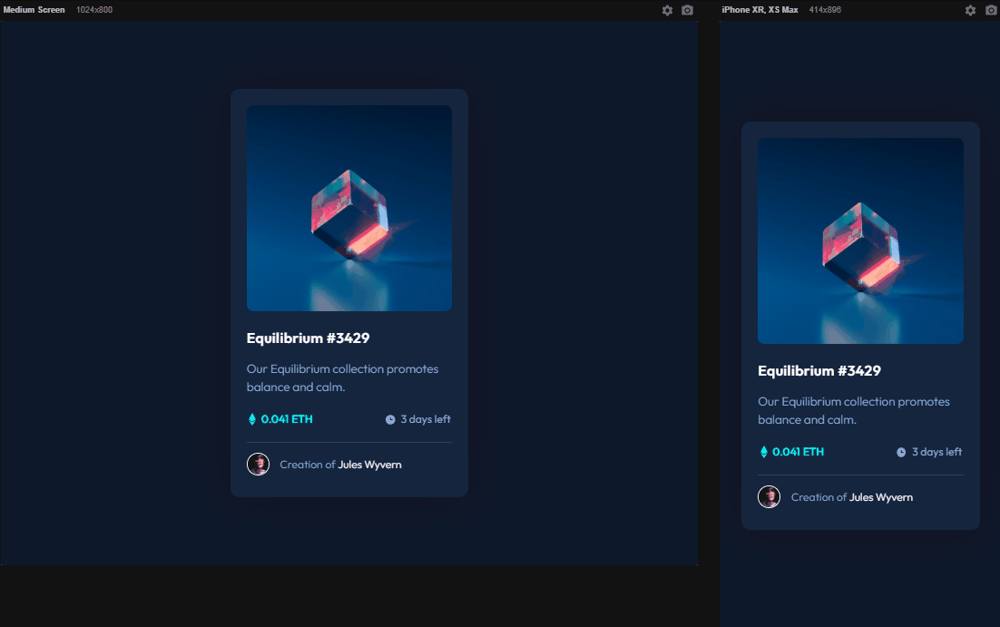

# NFT Preview Card Component

Esse projeto é um desafio encontrado na página do *[Frontend Mentor](https://www.frontendmentor.io/challenges/nft-preview-card-component-SbdUL_w0U)* que consiste em replicar este cartão de anúncio proposto utilizando as linguagens de *HTML* e *CSS*. 

Todas as orientações e ferramentas, como o tipo de fonte, as cores e as imagens, são fornecidas pela plataforma, bastando que o desenvolvedor ponha em prática seus conhecimentos das duas linguagens necessárias e construa o cartão o mais parecido possível com o design proposto.

## Linguagens usadas
- ***HTML***
- ***CSS***

## Desafios e dificuldades

Este projeto foi feito no primeiro mês de aprendizado *HTML* e *CSS*, então me deparei com algumas dificuldades no *CSS*, principalmente ao trabalhar com pseudo-classes como ***::before*** e ***::after***, como também replicar o design o mais próximo possível.

O suporte do curso Devquest dos irmãos [Dev em Dobro](https://www.youtube.com/@DevemDobro) fez toda diferença apresentando soluções sobretudo no que tange a dar maior semelhança com o projeto original, através de algumas extensões do *Chrome*.